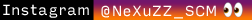

# Snippets - Practicas con colecciones avanzadas
#### :white_check_mark:Este codigo tiene la finalidad de instruir en el uso de distintos tipos de colecciones.

* Pilas
* Colas
* HashSet
* Dicctionary
* List

Empleando objetos y tipos primitivos. :octopus:

**↓↓↓ Donde Encontrarme @_@ Where to find me ↓↓↓**

>Los siguientes enlaces no se abrirán :boom: en otra pestaña :sweat_smile:, esta es una característica no soportada :sweat: por markedown ni por github  :sweat: ,  :question: quizá le convenga :smirk: dar clic derecho y luego en **| Abrir enlace en una pestaña nueva |** :grin:

  
  
  
  
  
  
  
  
 

### El programa es :100:% gratis y libre para la comunidad. :gem:
###### -> Apoyo a la FreeSoftware Fundation 
 **Copyright (C) 2019 Cristian M. Sguazzin**

    Este programa es software libre: puedes redistribuirlo y / o modificarlo.
    bajo los términos de la Licencia Pública General GNU tal como fue publicada por
    la Free Software Foundation, ya sea la versión 3 de la Licencia, o
    (a su elección) cualquier versión posterior.

    Este programa se distribuye con la esperanza de que sea útil,
    pero SIN NINGUNA GARANTÍA; sin siquiera la garantía implícita de
    COMERCIABILIDAD o APTITUD PARA UN PROPÓSITO PARTICULAR. Ver el
    GNU General Public License para más detalles.

    Debería haber recibido una copia de la Licencia Pública General de GNU
    junto con este programa. Si no, vea <https://www.gnu.org/licenses/>.